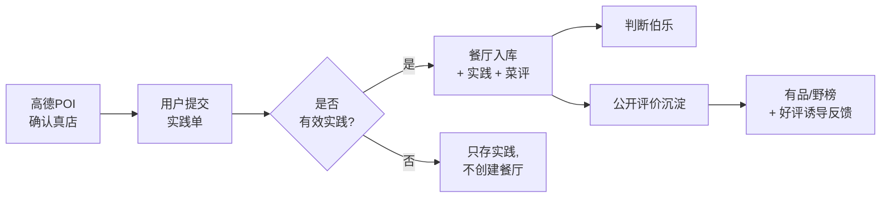

# 食鉴 · ShiJian

> 一款以「个人食鉴图」为核心、由 C 端用户共建的真实餐厅评价产品。

「食鉴」通过高德 POI 先确认真实店铺，但不把浏览和选择行为入库；只有用户完成包含菜品打分的有效实践后，店铺才正式进入食鉴数据库。

## 仓库结构

```
shijian/
├─ docs/                  产品 / 数据库定版说明书（由 .docx 转换而来）
├─ supabase/              后端：数据库迁移 / 种子数据 / Edge Functions
├─ web/                   前端：Vite + React + TS + Tailwind
├─ .scripts/              辅助脚本（如 docx 转 markdown）
├─ 食鉴p0开发定版说明书.docx
└─ 食鉴p0 Supabase后端数据库定版说明书.docx
```

> `docs/` 下的 markdown 是 .docx 的镜像副本，便于在仓内直接搜索和引用；
> 以 .docx 原件为准。如需重新生成 markdown：`py -3 .scripts/docx_to_md.py`

## 技术栈

| 层 | 选型 | 备注 |
| --- | --- | --- |
| 前端框架 | Vite 8 + React 19 + TypeScript 6 | |
| 样式 | Tailwind CSS v4（`@tailwindcss/vite`）| |
| 路由 | React Router v7 | |
| 状态 | TanStack Query（服务端） + Zustand（本地）| |
| 后端 | Supabase（Postgres + Auth + Storage + Edge Functions）| 需自行创建 Supabase 项目 |
| POI | `MockPoiProvider`（P0 默认） / `AmapPoiProvider`（拿到 Key 后切换） | |
| 地图 | Leaflet + React Leaflet | 用于地图选点 / 门店定位 |
| 包管理 | pnpm 11（通过 corepack）| |

## 里程碑


当前进度：主链路、三步实践提交、餐厅/菜品详情、门店搜索/地图、个人页、我的标记/伯乐、手机号登录注册与资料编辑均已接入。数据库迁移以 `supabase/migrations/` 中的实际文件为准，基础迁移包含 `0001`～`0005`、`0008`～`0013_profiles_detail_fields`；另有指定手机号测试帐号脚本 `0013_set_auth_password_for_phone_137.sql`，仅限个人调试。部署说明见 `supabase/README.md`。

## 前端页面

- `/`：首页与分档入口
- `/search`、`/map`：门店搜索与地图选点
- `/practice/step1`～`/practice/step3`：实践提交主流程
- `/practice/manual`：手动录入门店
- `/restaurants/:id`、`/dishes/:id`：餐厅与菜品详情
- `/me`、`/me/edit`、`/me/marks`、`/me/bole`：个人中心、资料编辑、标记与伯乐
- `/auth`：手机号密码登录；注册 / 忘记密码使用短信验证码；研发模式可选邮箱入口

## 本地开发

### 前置

- Node 22+
- pnpm 11（如未安装：`corepack enable && corepack prepare pnpm@latest --activate`）

### 启动前端

```bash
cd web
cp .env.example .env.local   # 编辑后填入 Supabase 凭据
pnpm install
pnpm dev
```

默认地址：`http://localhost:5173`

### 应用 Supabase 迁移

进 [Supabase Dashboard](https://supabase.com/dashboard) 的 SQL Editor，按文件名顺序粘贴执行 `supabase/migrations/` 下的 SQL 文件，再执行 `supabase/seed.sql`。具体顺序、注意事项与 smoke test 见 `supabase/README.md`。

## 环境变量（`web/.env.local`）

| 变量 | 用途 | 何时必填 |
| --- | --- | --- |
| `VITE_SUPABASE_URL` | Supabase 项目 URL | 接入真实数据 / 登录 / 提交时必填 |
| `VITE_SUPABASE_ANON_KEY` | Supabase 匿名公钥 | 接入真实数据 / 登录 / 提交时必填 |
| `VITE_POI_PROVIDER` | `mock`（默认）/ `amap` | 可选 |
| `VITE_AMAP_KEY` | 高德 Web 服务 Key | `VITE_POI_PROVIDER=amap` 时必填 |
| `VITE_AUTH_LAX_DEV` | 本地 dev 放行模式开关，设 `false` 可强制真实登录 | 可选 |
| `VITE_AUTH_STRICT_AUTH` | 本地强制真实登录 | 可选 |
| `VITE_FIXTURE_AUTO_LOGIN` | 使用 fixture 帐号自动登录 | 可选 |
| `VITE_FIXTURE_EMAIL` / `VITE_FIXTURE_PASSWORD` | fixture 登录凭据 | `VITE_FIXTURE_AUTO_LOGIN=true` 时必填 |
| `VITE_ENABLE_EMAIL_AUTH` | 在登录页显示研发邮箱入口 | 可选 |

## 主链路概览



「有效实践」三要素：有真店 + 至少 1 道菜 + 至少 1 道菜有 0–10 分打分。
